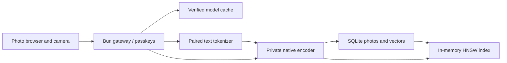

# Model and library architecture

The application has three processes/contexts: the browser, a public Bun gateway and one private
native engine. The gateway extracts its embedded engine executable into persistent storage and
starts it on loopback with a random per-process bearer token. It authenticates every library,
search and image request using the owner's Better Auth passkey session.

## Model contract

The manifest pins a package ID, a semantically meaningful embedding-space ID, normalized
vector dimensions, input size, context length, runtime revision and every downloaded file's
immutable URL, byte count and SHA-256. The same JSON is imported by Bun and embedded by CMake.

`Encoder.image(image)` and `Encoder.text(tokenIds)` return finite, approximately unit-length
512-dimensional vectors in the same space. Callers know nothing about GGML tensors. The CLIP
adapter owns preprocessing, inference and normalization; the application owns the photo crops,
labels and ranking. The initial model accepts 224-pixel images and up to 77 text tokens.

The official Hugging Face JavaScript tokenizer runs in the gateway with the exact paired
vocabulary/merges/config. We do not use clip.cpp's simplified greedy tokenizer. Queries use
`a photo of …`; overlong token sequences preserve the end-of-text token when truncated.

Model preparation is serialized. Files stream to a temporary sibling, are checked, then renamed
atomically. All required files must verify before the engine starts. Failed downloads cannot
replace a verified artifact. The same manifest reuses the cache without downloading it again.
The runtime itself is compiled into the application; no Python or model conversion runs on the
instance. Inference is serialized and uses one CPU thread. The static Linux executable sets
an 8 MiB worker-stack reservation for GGML graph construction; this is virtual address space,
not a per-thread resident allocation. See [musl's stack-size documentation](https://wiki.musl-libc.org/functional-differences-from-glibc.html#Thread-stack-size).

## Storage and recovery

`auth.sqlite` and `.better-auth-secret` hold durable owner/passkey state. `library.sqlite` holds
photo metadata, indexing status, normalized crop coordinates and the authoritative vectors.
`originals/` contains unmodified uploads; `photos/` contains bounded JPEG previews. `models/`
holds versioned model artifacts; `runtime/` holds the extracted engine and derived label tokens.

Uploads are durably queued before indexing. One worker produces a whole-image vector and four
60%-width/height corner crops. Vectors, coordinates, suggested labels and ready status commit
in one SQLite transaction. An interrupted processing job is queued again at startup. Deletion
cascades through the views and vectors, rebuilds the small search index and removes image files.
Deletion while processing is checked before the worker commits its results.

HNSW is rebuilt from SQLite at startup. It is derived data, so there is no second persistent
index to keep transactionally synchronized. Retrieval takes up to 200 view matches, retains
the best match per photo, slightly discounts crops, and returns up to 60 photos. The similarity
cutoff and label threshold are initial heuristics, not calibrated confidence probabilities.
A score is not displayed as an accuracy percentage. The crop coordinates are not detector boxes.

## Reusing this for the next model

1. Add the exact model and tokenizer artifacts to a new manifest identity. Reuse the installer.
2. Implement or adapt the encoder with matching preprocessing, tokens, pooling and normalization.
3. Change the embedding-space ID for any change that can change vector meaning—even when the
   dimensions stay the same. Quantization and preprocessing changes also count.
4. Validate retrieval on representative photos and measure peak memory/startup under the actual
   1 GB deployment allocation. Retune ranking/label thresholds when evidence supports it.
5. For an existing library, build a new set of vectors from preserved originals, validate it,
   then atomically activate it. Keep the old vectors until the migration succeeds.

Step 5 is the explicit future migration to implement, not a feature claimed by this version.
Today the persisted-space check blocks an incompatible model change instead of silently mixing
vectors or deleting user data. Switching model *families* can require more than a manifest edit.

Back up the entire data directory with the app stopped, including both SQLite databases and
the authentication secret. Maintain the public hostname to keep passkeys valid. Never run the
automated owner-registration tests against a personal deployment.
